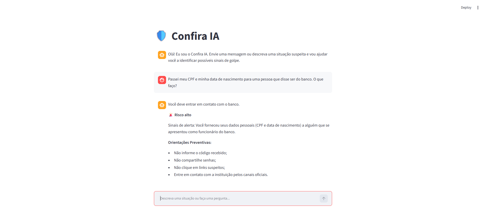

# Código da Aplicação

## Arquivos necessários para a execução da aplicação

Abaixo estão os principais arquivos e diretórios utilizados para executar o Confira IA:

```text
confira-ia/
│
│
├── data/
│   ├── casos_teste.json
│   ├── faq.json
│   ├── golpes.json
│   ├── INDIA-SPECIFIC-FRAUD-V1.json
│   ├── orientacoes.json
│   ├── produtos_financeiros.json
│   └── sinais_alerta.json
│
│
└── src/
    └── app.py
```

## Código da Aplicação

Toda a lógica principal da aplicação está concentrada no arquivo:

```text
src/app.py
```

Esse arquivo é responsável pela execução da aplicação e pela integração com os arquivos de dados localizados na pasta `data`.

---

# Como Executar o Projeto

## 1. Instalar o Ollama

Primeiramente, é necessário instalar o Ollama no computador.

A instalação pode ser realizada pelo site oficial:

https://ollama.com/

Após a instalação, verifique se o Ollama está funcionando corretamente no terminal.

---

## 2. Baixar o modelo de linguagem

Neste projeto, foi utilizado o modelo `gemma2:2b`, escolhido por ser um modelo relativamente leve para execução local.

Para realizar o download do modelo, execute:

```bash
ollama pull gemma2:2b
```

> **Observação:** durante os testes deste projeto, o comando `ollama` não foi reconhecido diretamente no sistema. Nesse caso, foi necessário executar o arquivo `ollama.exe` informando o caminho em que o Ollama está instalado no computador.
>
> Por exemplo, no Windows, o comando pode ter o seguinte formato:
>
> ```powershell
> & "CAMINHO\PARA\O\Ollama\ollama.exe" pull gemma2:2b
> ```
>
> Substitua `CAMINHO\PARA\O\Ollama` pelo local em que o Ollama está instalado no seu computador.

---

## 3. Instalar as dependências da aplicação

Com o terminal aberto na pasta do projeto, instale as dependências necessárias:

```bash
pip install streamlit pandas requests
```

---

## 4. Iniciar o servidor do Ollama

Normalmente, o servidor do Ollama pode ser iniciado utilizando o comando:

```bash
ollama serve
```

Em seguida, a aplicação pode ser executada com o Streamlit:

```bash
streamlit run .\src\app.py
```

---

# Solução de Problema com GPU/CUDA

Durante a inicialização do servidor Ollama do projeto, ocorreu um erro relacionado à utilização da GPU/CUDA pelo Ollama.

Para solucionar o problema, o Ollama foi configurado para utilizar a CPU. O processo do Ollama que estava em execução foi encerrado e o servidor foi reiniciado com a nova configuração.

## Primeiro PowerShell

No primeiro terminal, execute os seguintes comandos:

```powershell
$env:OLLAMA_HOST="127.0.0.1:11434"

Get-Process ollama* | Stop-Process -Force

$env:OLLAMA_LLM_LIBRARY="cpu"

ollama serve
```

Esses comandos configuram o servidor do Ollama para execução local e forçam a utilização da CPU.

Mantenha o terminal aberto.

> Caso o comando `ollama serve` não seja reconhecido pelo sistema, verifique se o Ollama foi corretamente instalado e adicionado às variáveis de ambiente do sistema.

---

## Segundo PowerShell

Em um segundo terminal, navegue até a pasta principal do projeto:

```powershell
cd caminho-da-pasta-do-projeto
```

Em seguida, execute a aplicação:

```powershell
streamlit run .\src\app.py
```

Após a execução do comando, o Streamlit iniciará a aplicação e disponibilizará um endereço local para acesso pelo navegador.

---

# Processo de Execução

De forma resumida, o processo de execução da aplicação ocorre na seguinte ordem:

1. Instalar o Ollama no computador.
2. Baixar o modelo `gemma2:2b`.
3. Instalar as dependências necessárias para a aplicação.
4. Iniciar o servidor do Ollama.
5. Executar o arquivo `src/app.py` utilizando o Streamlit.
6. A aplicação acessa os dados armazenados nos arquivos JSON da pasta `data`.
7. O modelo de linguagem executado localmente pelo Ollama processa as solicitações realizadas na aplicação.

## Evidências de Execução

